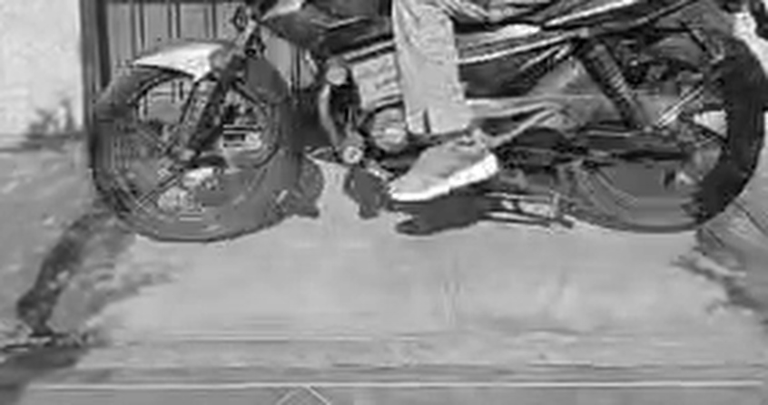
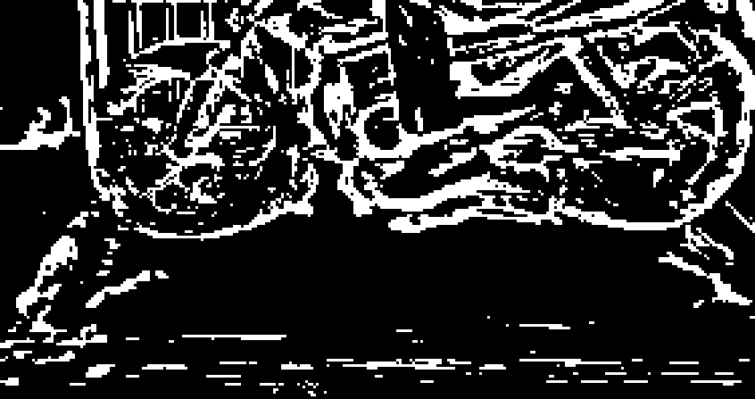
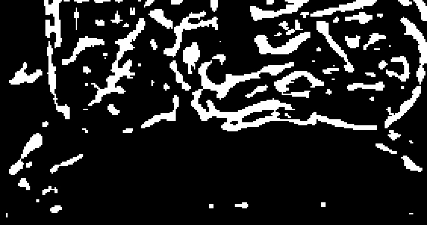
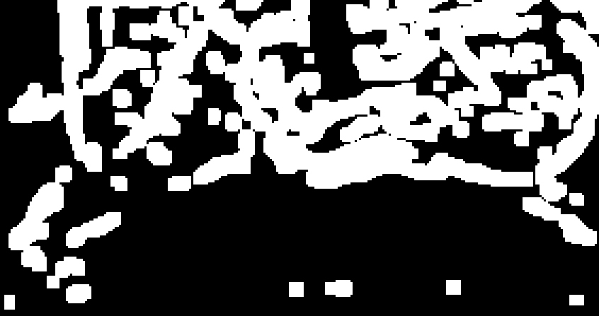

- Colocar el video en `data/video.mp4`

## Instalación

```bash
# 1. Crear entorno virtual
python3 -m venv venv
source venv/bin/activate  # En Windows: .\venv\Scripts\activate

# 2. Instalar dependencias
pip install -r requirements.txt
```

## Ejecución

```bash
# Ejecución con ventana gráfica
python main.py

# Ejecución sin ventana (modo headless / máxima velocidad)
python main.py --no-display
```

## Pipeline de procesamiento digital de imágenes

### 1. Conversión a Escala de Grises



### 2. Umbralización Adaptativa Invertida



### 3. Filtro No Lineal de Mediana



### 4. Dilatación Morfológica


